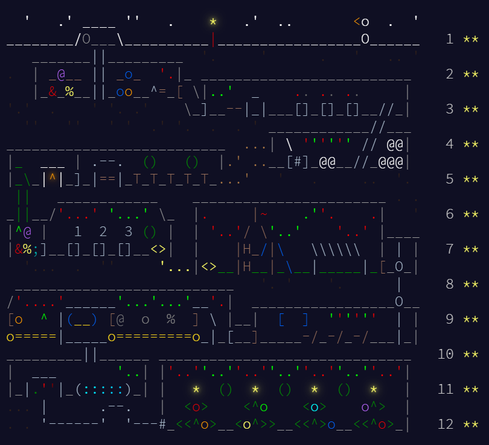

# Advent of Code 2025

Solutions to [Advent of Code 2025](https://adventofcode.com/2025), written in Rust.

**23 solutions across 12 days** — both parts for days 1 through 11, and part one of day 12.



## No dependencies

Every solution is **pure Rust standard library**. Across all 23 crates the only entries in any
`Cargo.lock` are the local packages themselves — no `regex`, no `itertools`, no helper crates.

That is a deliberate constraint rather than an oversight. Advent of Code problems are mostly parsing
and iteration, and doing them with `std` alone means writing the parsing rather than reaching for a
crate that hides it. It also means every solution builds offline from a clean checkout in a couple
of seconds.

## Layout

```
day1/
  input.txt        the puzzle input
  test.txt         the worked example from the problem statement
  part1/           a standalone cargo crate
    src/main.rs
    Cargo.toml
  part2/           a second crate, since part two usually changes the approach
```

Each part is its own crate rather than a shared binary with a mode flag. Advent of Code part twos
frequently invalidate the data structure part one chose — a brute-force scan that becomes a
memoised search, a grid that becomes a graph — so keeping them separate lets the second solution be
the one the problem actually wants, instead of an accretion on top of the first.

Each day also keeps `test.txt`, the small worked example from the problem statement, so a solution
can be checked against a known answer before being run against the real input.

## Running

Every solution reads `../input.txt` relative to its own crate directory, so run it from there:

```bash
cd day1/part1
cargo run
```

```
Number of times pointed at zero: 1165
```

To try the worked example instead, point the `read_to_string` call at `../test.txt`.

## Days

| Day | Part 1 | Part 2 |
|---|---|---|
| 1 | ✅ | ✅ |
| 2 | ✅ | ✅ |
| 3 | ✅ | ✅ |
| 4 | ✅ | ✅ |
| 5 | ✅ | ✅ |
| 6 | ✅ | ✅ |
| 7 | ✅ | ✅ |
| 8 | ✅ | ✅ |
| 9 | ✅ | ✅ |
| 10 | ✅ | ✅ |
| 11 | ✅ | ✅ |
| 12 | ✅ | — |

About 1,800 lines of Rust in total. The longer solutions are the ones where the shape of the problem
drove the code — day 10 models each line as a target bit pattern plus a set of buttons that toggle
positions in it, and day 9 searches for the largest rectangle over a coordinate set.
